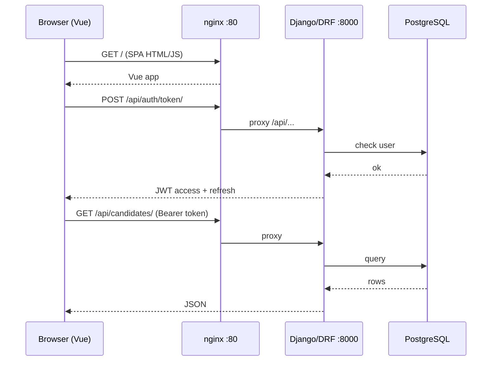

# Learning Guide — SQLI Interview Tracker

> **How we’ll learn:** (1) understand the whole system → (2) read each ticket “what & why” → (3) open the real files ticket-by-ticket.  
> That order is a good idea. Don’t memorize everything — use this file as a map.

**Related docs:** [`README.md`](./README.md) · [`SPEC.md`](./SPEC.md) · [`TICKETS.md`](./TICKETS.md) · [`BRAND.md`](./BRAND.md) · [`DEMO.md`](./DEMO.md)

---

## Part 1 — The whole project (big picture)

### What is this app?

An **internal hiring tool for SQLI**:

| Who | What they do |
|-----|----------------|
| **Recruiter / Admin** | Create jobs, add candidates, move pipeline stages, schedule interviews, use AI tools, see dashboard |
| **Interviewer** | See assigned interviews, submit scorecards |
| **System** | JWT auth, RBAC, notifications, AI (mock/OpenAI/Ollama), Postgres |

**User journey (happy path):**  
Login → create job → add candidate → drag on kanban → schedule interview → interviewer scores → AI hiring brief → dashboard funnel.

### How a click becomes data



**Local dev (no Docker nginx):** Vite on `:5173` proxies `/api` → Django `:8000`.  
**Production Docker:** Browser only talks to `:80`; nginx serves Vue and proxies `/api` + `/media`.

### Repo map (where things live)

```
sqli-interview-tracker/
├── backend/
│   ├── config/           # Django settings, root urls, wsgi
│   ├── apps/
│   │   ├── accounts/     # User, JWT, RBAC, profile
│   │   ├── jobs/         # JobOpening, PipelineStage
│   │   ├── candidates/   # Candidate, resume, activity, stage move
│   │   ├── interviews/   # Interview + interviewers M2M
│   │   ├── scorecards/   # Ratings + aggregation
│   │   ├── ai_assistant/ # AI providers + sessions
│   │   ├── notifications/
│   │   ├── dashboard/    # Funnel + stats APIs
│   │   └── core/         # health, seed_demo
│   ├── manage.py
│   └── Dockerfile
├── frontend/
│   ├── src/
│   │   ├── api/          # Axios calls per domain
│   │   ├── stores/       # Pinia (auth, …)
│   │   ├── router/       # Routes + guards
│   │   ├── views/        # Pages
│   │   ├── components/   # Reusable UI
│   │   └── types/        # TypeScript types
│   ├── nginx.conf
│   └── Dockerfile
├── docker-compose.yml        # Production stack
├── docker-compose.dev.yml    # Hot reload
├── .github/workflows/ci.yml
└── docs / guides (README, LEARNING, …)
```

### Backend pattern (almost every app)

For each domain (`jobs`, `candidates`, …) you usually see:

| File | Role |
|------|------|
| `models.py` | Database tables |
| `serializers.py` | JSON ↔ model validation |
| `views.py` | HTTP endpoints (DRF) |
| `urls.py` | Route → view |
| `services.py` | Side effects (logs, notifications) |
| `tests.py` | Pytest / APITestCase |
| `migrations/` | Schema history |

### Frontend pattern

| Folder | Role |
|--------|------|
| `api/*.ts` | Talk to backend |
| `stores/*.ts` | Shared client state (auth tokens, user) |
| `views/**` | Full pages |
| `components/**` | Pieces used by pages |
| `router/index.ts` | URL → page + “must be logged in?” |

### Core data model (mental model)

```
User (role)
  └── creates → JobOpening
                  └── has many → PipelineStage (Applied, Screening, …)
                  └── has many → Candidate (current_stage, resume)
                                    └── has many → CandidateActivity
                                    └── has many → Interview
                                                      ├── interviewers (Users)
                                                      └── Scorecard (per interviewer)
Notification (user, message, read?)
AISession (user, type, input/output JSON)
```

### Auth in one paragraph

User logs in → backend returns **access** + **refresh** JWTs → Axios puts `Authorization: Bearer <access>` on every request → if access expires, interceptor refreshes → Django permission classes (`IsRecruiter`, `IsAdmin`, …) decide if the action is allowed.

### AI in one paragraph

`AIService` picks a provider from `AI_PROVIDER` (`mock` / `openai` / `ollama`). Views call methods like generate questions / summarize / mock chat, then save an `AISession`. UI lives mainly in `AIToolsView.vue` + hiring brief on candidate detail.

---

## Part 2 — How to use this guide with me

1. Read **Part 1** once (you’re doing that).
2. Skim the **epic summaries** below.
3. Tell me: **“explain INT-009”** (or any ID) → we open the real files and walk line by line.
4. Optional: after each epic, you re-explain it in your own words (best way to lock it in).

Suggested order = ticket order (setup → auth → jobs → candidates → interviews → AI → shell → ship).

---

## Part 3 — Every ticket: what it did + where to look

### EPIC 0 — Project setup (INT-001 → 008)

Scaffold so the team can run, lint, and CI the empty shell.

| ID | What we built (in practice) | Key files / places |
|----|-----------------------------|--------------------|
| **INT-001** | Monorepo folders: `backend/`, `frontend/`, root config, `.gitignore` | Repo root layout |
| **INT-002** | Django 5 + DRF + CORS + environ; `/api/health/` | `backend/config/`, `apps/core/` |
| **INT-003** | Vue 3 + Vite + TS + Router + Pinia + Axios; Vite `/api` proxy | `frontend/`, `vite.config.ts` |
| **INT-004** | Postgres in Compose; Django `DATABASE_URL` | `docker-compose*.yml`, settings `DATABASES` |
| **INT-005** | Tailwind + SQLI CSS variables (cream, midnight, cobalt, sky) | `frontend` styles / brand tokens, `BRAND.md` |
| **INT-006** | Ruff (backend), ESLint/Prettier hooks; `make lint` | `pyproject.toml`, frontend lint script |
| **INT-007** | Makefile targets + `.env.example` | `Makefile`, `.env.example` |
| **INT-008** | GitHub Actions: lint + pytest | `.github/workflows/ci.yml` |

**Idea to remember:** nothing “business” yet — only the runway.

---

### EPIC 1 — Authentication (INT-009 → 015)

Who is the user, how they prove it, what they’re allowed to do, and the login UI.

| ID | What we built | Key files |
|----|---------------|-----------|
| **INT-009** | Custom `User` model: email login, roles (`admin`, `recruiter`, `interviewer`, `hiring_manager`) | `apps/accounts/models.py` |
| **INT-010** | JWT obtain / refresh (simplejwt) | `accounts/views.py`, `urls.py`, settings `SIMPLE_JWT` |
| **INT-011** | DRF permission classes (`IsAdmin`, `IsRecruiter`, …) | `apps/accounts/permissions.py` |
| **INT-012** | Register (admin), `/me` profile, change password, user list/patch | `accounts/views.py`, `serializers.py` |
| **INT-013** | Pinia auth store + Axios interceptor (attach token, refresh on 401) | `frontend/src/stores/auth.ts`, `api/client.ts` |
| **INT-014** | SQLI-branded Login / Register pages | `views/LoginView.vue`, `RegisterView.vue`, `AuthBrandHeader.vue` |
| **INT-015** | Router guards: public vs auth routes, role redirects | `frontend/src/router/index.ts` |

**Idea to remember:** backend enforces security; frontend only *hides* buttons — never trust the UI alone.

---

### EPIC 2 — Jobs (INT-016 → 019)

Job openings and their hiring pipeline stages.

| ID | What we built | Key files |
|----|---------------|-----------|
| **INT-016** | `JobOpening` model + CRUD API | `apps/jobs/models.py`, `views.py`, `serializers.py` |
| **INT-017** | `PipelineStage` (defaults + copy per job); seed helpers / signals | `jobs/models.py`, `services.py`, `signals.py` |
| **INT-018** | Jobs list + detail Vue pages | `views/jobs/JobsListView.vue`, `JobDetailView.vue`, `api/jobs.ts` |
| **INT-019** | Create/edit job form + skills tags | `JobFormView.vue`, `SkillsTagInput.vue` |

**Idea to remember:** every candidate later hangs off a **job** and a **stage** of that job.

---

### EPIC 3 — Candidates (INT-020 → 026)

People in the pipeline: CRUD, resume, stage moves, audit log, table + kanban + detail.

| ID | What we built | Key files |
|----|---------------|-----------|
| **INT-020** | `Candidate` model + CRUD API | `apps/candidates/models.py`, `views.py` |
| **INT-021** | Resume upload (PDF/DOCX size limits) | `validators.py`, candidate serializer/views |
| **INT-022** | Move candidate between stages (API) | `candidates/views.py` + services |
| **INT-023** | `CandidateActivity` timeline / audit | `candidates/models.py`, `services.py` |
| **INT-024** | Candidate table + search/filter UI | `CandidatesView.vue`, `CandidatesTable.vue` |
| **INT-025** | Kanban drag & drop (`vuedraggable`) | `CandidatesKanban.vue` |
| **INT-026** | Candidate detail + timeline UI | `CandidateDetailView.vue` |

**Idea to remember:** kanban is UX on top of the same “change `current_stage`” API.

---

### EPIC 4 — Interviews & scorecards (INT-027 → 033)

Schedule meetings, assign interviewers, collect structured feedback, show consensus.

| ID | What we built | Key files |
|----|---------------|-----------|
| **INT-027** | `Interview` model + CRUD API | `apps/interviews/models.py`, `views.py` |
| **INT-028** | Many interviewers per interview (M2M) | `interviews` serializers/views |
| **INT-029** | Calendar-style interviews UI | `InterviewsCalendarView.vue` |
| **INT-030** | Schedule interview modal | `ScheduleInterviewModal.vue` |
| **INT-031** | `Scorecard` model + submit API (marks interview completed) | `apps/scorecards/` |
| **INT-032** | Scorecard form UI + “My Interviews” | `ScorecardFormView.vue`, `MyInterviewsView.vue` |
| **INT-033** | Aggregate scorecards on candidate page | `aggregation.py`, `CandidateScorecardsPanel.vue`, `utils/scorecardAggregate.ts` |

**Idea to remember:** one interview → many scorecards (one per interviewer) → averages/consensus on the candidate.

---

### EPIC 5 — AI features (INT-034 → 038)

Pluggable AI + three product features + history.

| ID | What we built | Key files |
|----|---------------|-----------|
| **INT-034** | `AIService` + OpenAI / Ollama / Mock providers + rate limit | `ai_assistant/base.py`, `*_provider.py`, `services.py`, `rate_limit.py` |
| **INT-035** | Generate interview questions API + UI panel | `ai_assistant/views.py`, `AIToolsView.vue` |
| **INT-036** | Hiring brief from scorecards + UI on candidate | summarize endpoint, `CandidateDetailView.vue` |
| **INT-037** | Mock interview chat API + chat UI | mock chat views, `AIToolsView.vue` (mock tab) |
| **INT-038** | `AISession` history list/detail/filters | `ai_assistant/models.py`, sessions endpoints + UI history |

**Idea to remember:** default `AI_PROVIDER=mock` so demos work without API keys.

---

### EPIC 6 — Shell, dashboard, notifications, settings (INT-039 → 042)

The “product chrome” around features.

| ID | What we built | Key files |
|----|---------------|-----------|
| **INT-039** | App shell: sidebar + topbar (collapsible) | `AppLayout.vue`, router layout |
| **INT-040** | Dashboard funnel chart + stats API/UI | `apps/dashboard/`, `DashboardView.vue` |
| **INT-041** | In-app notifications (bell, mark read) | `apps/notifications/`, layout bell, `api/notifications.ts` |
| **INT-042** | Settings: profile, password, admin user mgmt | `SettingsView.vue`, accounts profile/admin APIs |

**Idea to remember:** notifications are often **triggered from services** when interviews are scheduled, etc.

---

### EPIC 7 — Seed, tests, Docker, docs, demo (INT-043 → 048)

Make it demoable, testable, shippable, explainable.

| ID | What we built | Key files |
|----|---------------|-----------|
| **INT-043** | `seed_demo` management command (users, jobs, candidates, interviews, scorecards) | `apps/core/management/commands/seed_demo.py` |
| **INT-044** | Broad backend tests + **≥70%** coverage gate in Make/CI | `apps/**/tests.py`, `pyproject.toml`, `Makefile`, `ci.yml` |
| **INT-045** | Manual UI checklist covering SPEC §10 | `TESTING.md` |
| **INT-046** | Multi-stage Dockerfiles + nginx proxy + production Compose | `backend/Dockerfile`, `frontend/Dockerfile`, `nginx.conf`, `docker-compose.yml` |
| **INT-047** | README architecture + env/make docs; Swagger `/api/docs/` | `README.md`, `drf-spectacular` urls |
| **INT-048** | Demo script + tickets marked done; **you** record the video | `DEMO.md`, `TICKETS.md` |

**Idea to remember:** Docker is how a mentor runs everything with one command; seed is how the demo has data.

---

## Part 4 — Cheat sheet: “If I want to understand X…”

| Topic | Start here |
|-------|------------|
| Login / JWT | `stores/auth.ts` → `api/client.ts` → `accounts/views.py` |
| Permissions | `accounts/permissions.py` → any `views.py` `permission_classes` |
| Jobs pipeline | `jobs/models.py` → `jobs/services.py` |
| Kanban move | `CandidatesKanban.vue` → `api/candidates.ts` → candidates move endpoint |
| Scorecards | `scorecards/models.py` → `ScorecardFormView.vue` → `aggregation.py` |
| AI | `ai_assistant/services.py` → `views.py` → `AIToolsView.vue` |
| Dashboard | `dashboard/views.py` → `DashboardView.vue` |
| Docker path | `docker-compose.yml` → `frontend/nginx.conf` → `backend/docker-entrypoint.sh` |

---

## Part 5 — Next step

When you’re ready, say which ticket to open first. Recommended start after this file:

**`INT-009` (User model)** → then **`INT-010` (JWT)** → then **`INT-013` (frontend auth store)**.

That trio is the spine everything else hangs on.
