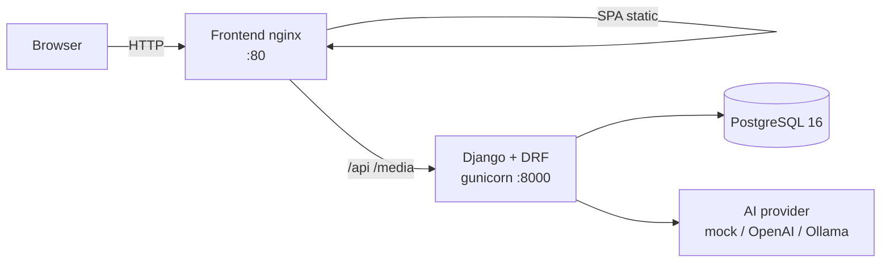

# SQLI Interview Tracker

Internal interview & candidate tracking platform for SQLI recruiters and hiring managers, with AI-assisted workflows.

> **"We Elevate. Digitally."**

**Repo:** https://github.com/maaqoul/sqli-interview-tracker

| Doc | Purpose |
|-----|---------|
| [`SPEC.md`](./SPEC.md) | Product & technical specification |
| [`BRAND.md`](./BRAND.md) | SQLI colors, typography, logos |
| [`TICKETS.md`](./TICKETS.md) | Ticket board (INT-001 → INT-048) |
| [`TESTING.md`](./TESTING.md) | Manual frontend test checklist |
| [`DEMO.md`](./DEMO.md) | Final demo / recording script (SPEC §10) |
| [`LEARNING.md`](./LEARNING.md) | **Understand the project** — big picture + every ticket |
| [`INTERN-GUIDE.md`](./INTERN-GUIDE.md) | Extended intern setup notes |
| [`WORKFLOW.md`](./WORKFLOW.md) | Commits, PRs, definition of done |

---

## Architecture



| Layer | Tech |
|-------|------|
| Frontend | Vue 3 + TypeScript + Vite + Pinia + Tailwind (SQLI tokens from [`BRAND.md`](./BRAND.md)) |
| Backend | Django 5 + Django REST Framework + JWT |
| Database | PostgreSQL 16 (SQLite for local tests) |
| AI | `AI_PROVIDER=mock` by default; OpenAI or Ollama optional |
| Deploy | Docker Compose — multi-stage images, nginx proxies `/api` |

---

## Quick start (Docker — recommended)

Needs only **Docker Desktop** (and WSL2 on Windows).

```bash
git clone https://github.com/maaqoul/sqli-interview-tracker.git
cd sqli-interview-tracker
cp .env.example .env
docker compose up --build
```

| URL | What |
|-----|------|
| http://localhost | Vue app (nginx) |
| http://localhost/api/docs/ | Swagger UI (DRF Spectacular) |
| http://localhost/api/schema/ | OpenAPI schema |
| http://localhost:8000/api/docs/ | Same docs via backend port |

Demo seed runs on first start (`SEED_DEMO=1`). Password for all seed users: **`DemoPass123!`**

| Role | Email |
|------|-------|
| Admin | `admin@sqli.com` |
| Recruiter | `recruiter1@sqli.com` |
| Interviewer | `interviewer1@sqli.com` |

Stop: `docker compose down`

---

## Local development (without Docker app stack)

```bash
cp .env.example .env
# For local SQLite, clear DATABASE_URL in .env or leave unset for backend defaults

make setup          # venv + pip + npm (Unix Make; on Windows use manual steps below)
make migrate
make seed
make dev-backend    # http://localhost:8000
make dev-frontend   # http://localhost:5173  (Vite proxies /api → :8000)
```

**Windows (PowerShell) without Make:**

```powershell
cd backend
python -m venv .venv
.\.venv\Scripts\Activate.ps1
pip install -r requirements.txt
$env:DATABASE_URL=""
python manage.py migrate
python manage.py seed_demo
python manage.py runserver
```

```powershell
cd frontend
npm install
npm run dev
```

Hot-reload Docker stack: `make dev-up` / `docker compose -f docker-compose.dev.yml up --build`

---

## Make commands

| Command | Description |
|---------|-------------|
| `make up` | Production Compose: build + start detached |
| `make down` | Stop Compose stack |
| `make build` | Build images only |
| `make dev-up` | Dev Compose (Vite + runserver) |
| `make setup` | Copy `.env`, install Python + Node deps |
| `make migrate` | Run Django migrations |
| `make seed` | Load demo users/jobs/candidates |
| `make test` | Pytest with **≥70%** coverage gate |
| `make lint` | Ruff + frontend lint |
| `make dev-backend` | Django runserver |
| `make dev-frontend` | Vite dev server |

---

## Environment variables

See [`.env.example`](./.env.example). Important keys:

| Variable | Purpose | Typical value |
|----------|---------|---------------|
| `DATABASE_URL` | Postgres (Compose) or omit for SQLite | `postgres://sqli:…@db:5432/sqli_interviews` |
| `DJANGO_SECRET_KEY` | Django secret | long random string |
| `DJANGO_DEBUG` | Debug mode | `False` in Compose |
| `DJANGO_ALLOWED_HOSTS` | Hosts | `localhost,127.0.0.1,backend,frontend` |
| `CORS_ALLOWED_ORIGINS` | Browser origins | `http://localhost,…` |
| `CSRF_TRUSTED_ORIGINS` | CSRF | `http://localhost,http://127.0.0.1` |
| `SEED_DEMO` | Seed on container start | `1` |
| `JWT_ACCESS_MINUTES` | Access token TTL | `15` |
| `JWT_REFRESH_DAYS` | Refresh token TTL | `7` |
| `AI_PROVIDER` | `mock` / `openai` / `ollama` | `mock` |
| `OPENAI_API_KEY` | OpenAI (if used) | — |
| `OLLAMA_BASE_URL` | Ollama (if used) | `http://localhost:11434` |
| `VITE_API_BASE_URL` | Frontend API base | empty in prod (same-origin `/api`) |

---

## API documentation

OpenAPI is generated by **drf-spectacular**.

- **Swagger UI:** [/api/docs/](http://localhost/api/docs/) (or http://localhost:8000/api/docs/)
- **Schema:** [/api/schema/](http://localhost/api/schema/)

Authenticate in Swagger with JWT: authorize using `Bearer <access_token>` from `POST /api/auth/token/`.

---

## Branding

UI follows [`BRAND.md`](./BRAND.md): SQLI blues + cream, midnight sidebar, logos under `frontend/public/assets/`. Login and shell are brand-first (not a generic admin theme).

---

## Testing

```bash
make test                 # backend, coverage ≥ 70%
# Manual UI: follow TESTING.md (covers SPEC.md §10)
```

CI (GitHub Actions): lint + pytest with the same coverage gate.

---

## Project status

Tickets **INT-001 → INT-048** are implemented (see [`TICKETS.md`](./TICKETS.md)). Final acceptance demo steps live in [`DEMO.md`](./DEMO.md).
